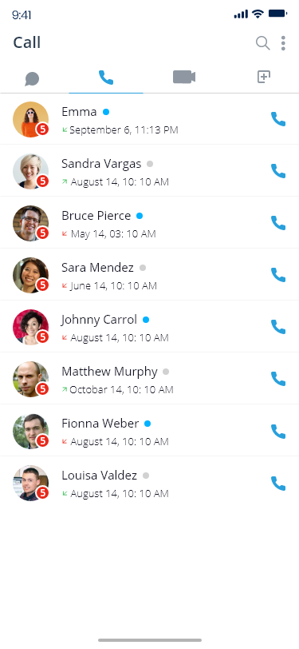
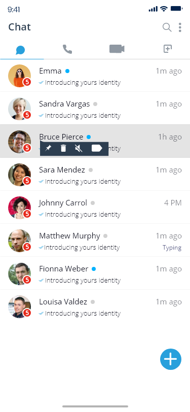

# LiveupX Skype Clone


A complete white-label solution for building your own video/audio conferencing platform similar to Skype. This repository contains the source code and documentation for LiveupX's Skype Clone, a powerful and feature-rich communication platform that supports video calls, audio calls, messaging, file sharing, and more.

 
 


## 🚀 Features

### Core Communication Features
- **HD Video Calls**: High-quality video calls supporting multiple participants
- **Voice Calls**: Crystal-clear audio calling functionality
- **Instant Messaging**: Real-time text chat with rich media support
- **Screen Sharing**: Share your screen during video conferences
- **File Sharing**: Send files, images, and documents securely

### Advanced Features
- **Group Calls**: Host conferences with multiple participants
- **End-to-End Encryption**: Secure communications between users
- **Push Notifications**: Real-time alerts for calls, messages, and activity
- **User Presence**: Online/offline/busy status indicators
- **Message History**: Access to chat history and search functionality
- **Multi-Device Support**: Synchronize chats across devices
- **Contact Management**: Add, remove, and organize contacts

### Platform Support
- iOS application
- Android application
- Web application
- Desktop application (Windows & macOS)

## 🛠️ Technology Stack

### Frontend
- React.js / React Native
- Redux for state management
- WebRTC for real-time communication
- Socket.io for real-time events
- Material UI / Native Base for UI components

### Backend
- Node.js with Express
- MongoDB for database
- Redis for caching and pub/sub
- Socket.io for WebSocket connections
- JWT for authentication
- Twilio/Agora SDK integration (optional)

### DevOps
- Docker for containerization
- AWS/GCP/Azure for cloud hosting
- CI/CD with GitHub Actions
- Kubernetes for orchestration (optional)

## 📋 Prerequisites

- Node.js (v16+)
- MongoDB (v4+)
- Redis Server
- Xcode for iOS builds (Mac only)
- Android Studio for Android builds
- TURN/STUN server setup (or use a service like Twilio)

## 🔧 Installation

### Clone the repository

```bash
git clone https://github.com/liveupx/skype-clone.git
cd skype-clone
```

### Server Setup

```bash
# Navigate to server directory
cd server

# Install dependencies
npm install

# Set up environment variables
cp .env.example .env
# Edit .env file with your configuration

# Start the development server
npm run dev
```

### Web Client Setup

```bash
# Navigate to web directory
cd web

# Install dependencies
npm install

# Start the development server
npm start
```

### Mobile Setup (React Native)

```bash
# Navigate to mobile directory
cd mobile

# Install dependencies
npm install

# iOS setup (Mac only)
cd ios && pod install && cd ..

# Run on iOS
npm run ios

# Run on Android
npm run android
```

## ⚙️ Configuration

The application uses environment variables for configuration. Copy the `.env.example` file to `.env` and update the values:

```
# Server Configuration
PORT=3000
NODE_ENV=development
API_URL=http://localhost:3000/api

# Database Configuration
MONGODB_URI=mongodb://localhost:27017/skype-clone

# JWT Configuration
JWT_SECRET=your_jwt_secret
JWT_EXPIRY=7d

# WebRTC Configuration
STUN_SERVER=stun:stun.l.google.com:19302
TURN_SERVER=your_turn_server
TURN_USERNAME=your_turn_username
TURN_PASSWORD=your_turn_password

# Push Notifications
FIREBASE_KEY=your_firebase_key
APN_KEY_PATH=path/to/apn/key
APN_KEY_ID=your_apn_key_id
```

## 🚗 Usage Guide

### User Registration and Login

1. Create an account using email or phone number
2. Verify your account
3. Log in with credentials
4. Update your profile information

### Making Calls

1. Select a contact from your contact list
2. Tap on the video or audio call icon
3. Wait for the recipient to accept the call
4. Enjoy HD quality communication

### Messaging

1. Select a contact or group
2. Type your message in the chat box
3. Send text, emojis, files, or media
4. View message status (sent, delivered, read)

### Admin Panel

The admin panel can be accessed at `/admin` with admin credentials. From here you can:

1. Manage users
2. View analytics
3. Configure system settings
4. Monitor service health

## 📱 Mobile App Features

The mobile application includes additional features:

- Push notifications
- Contact syncing
- Offline message queueing
- Battery optimization
- Background service management
- In-app updates

## 💻 API Documentation

API documentation is available using Swagger UI at `/api-docs` when running the server.

For detailed API documentation, refer to [API_DOCS.md](./docs/API_DOCS.md).

## 🤝 Contributing

We welcome contributions to improve the Skype Clone! Please follow these steps:

1. Fork the repository
2. Create a feature branch (`git checkout -b feature/amazing-feature`)
3. Commit your changes (`git commit -m 'Add some amazing feature'`)
4. Push to the branch (`git push origin feature/amazing-feature`)
5. Open a Pull Request

Please read [CONTRIBUTING.md](CONTRIBUTING.md) for details on our code of conduct and development process.

## 📄 License

This project is licensed under the MIT License - see the [LICENSE](LICENSE) file for details.

## ✨ Customization Services

Need custom features or integrations? LiveupX offers:

- Custom UI/UX design
- Additional feature development
- Enterprise-grade security enhancements
- White-labeling services
- Deployment and maintenance support

## 📞 Contact & Support

For questions, customization requests, or issues:

- **Email**: info@liveupx.com
- **WhatsApp**: +91-7060371701
- **Website**: [Liveupx.com](https://liveupx.com)
- **Landing page demo**: [Check Landing page] (https://skype-clone.pages.dev)
- **GitHub Issues**: For bug reports and feature requests

## 🔗 Related Projects

- [LiveupX Zoom Clone](https://github.com/liveupx/zoom-clone)
- [LiveupX Google Meet Clone](https://github.com/liveupx/google-meet-clone)
- [LiveupX Microsoft Teams Clone](https://github.com/liveupx/microsoft-teams-clone)

---

<p align="center">
  
  <br>
  <em>Developed with ❤️ by <a href="https://liveupx.com">LiveupX</a></em>
</p>
